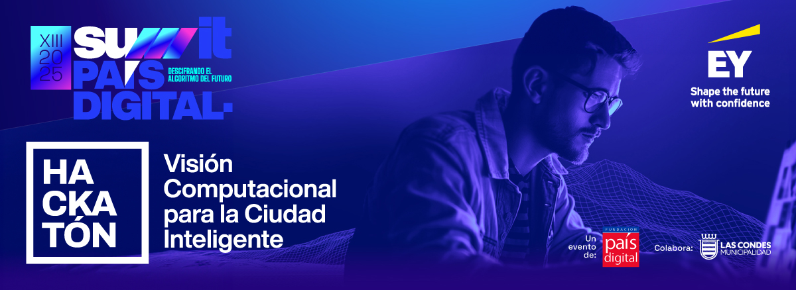

# Hackatón Summit País Digital 2025

Repositorio oficial de la Hackatón Summit País Digital by EY colabora Municipalidad Las Condes 2025

# Recursos útiles

Este repositorio está organizado por cada una de las sesiones que se llevarán a cabo, en este ciclo de capacitación. En cada una de las sesiones, se dejará el material que se haya revisado por parte del expositor

# Sesiones de YouTube

En el siguiente listado, se puede tener acceso a la grabación de la sesión respectiva:

- Sesión 1 Obligatoria: martes 09 de septiembre de 17:00 a 18:00 horas de Chile - Creatividad y resolución de problemas - [Link de acceso](https://youtu.be/e-NQJ_ImlQU?si=UGjoF62TfRrR2SyX)
- Sesión 2: Jueves 11 de septiembre de 17:00 a 18:00 horas de Chile - Contexto Gestión Pública - [Link de acceso](https://youtu.be/JdX3Zj8wwOU?si=lM85xrc294onMqq4)
- Sesión 3: Lunes 15 de septiembre de 17:00 a 18:00 horas de Chile - Bases de Computer Vision - [Link de acceso](https://youtu.be/ntuRo9ikYNg?si=ApzOMqsG2nU8pG7X)
- Sesión 4: Lunes 22 de septiembre de 17:00 a 18:00 horas de Chile - GenAI + Computer Vision Vanguardista - [Link de acceso](https://youtu.be/zZCex0O8TQI?si=uHngF0b0S_NdOEBq)
- Sesión 5: Jueves 25 de septiembre de 17:00 a 18:00 horas de Chile - Configuración de Ambiente de Desarrollo - _Próximamente_
- Sesión 6: Viernes 26 de septiembre de 17:00 a 18:00 horas de Chile – Pitch Class y aclaratorias generales - _Próximamente_

La playlist completa la puedes encontrar [en este Link.](https://youtube.com/playlist?list=PLoumkFfodoKod09M7wA3w7rd1jmcQu2gt&si=h4Y_EMoJLXkDetCQ)
